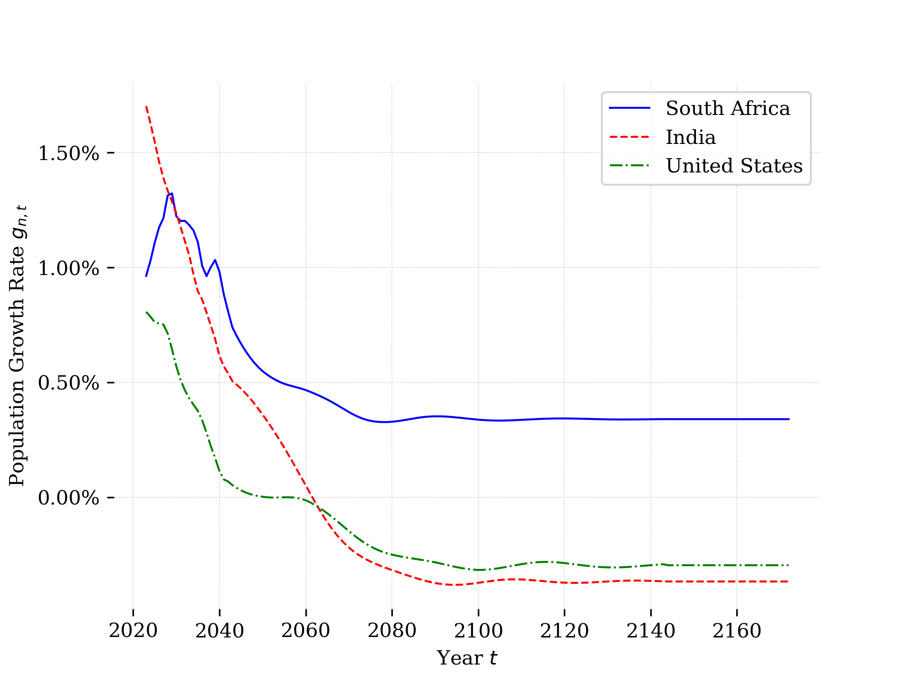

(Chap_OGcalibration)=

# Calibrating the `OG-Core` model

As noted in the introduction, the `OG-Core` model must be parametrized to represent a specific country. We refer to the process of finding parameter values that represent a specific economy as "calibration".  Because data sources for country-specific data differ, there's not a single way to calibrate all economies. We have therefor have created country-specific calibration packages.   Some examples of these include the [United States](https://github.com/PSLmodels/OG-USA), the [United Kingdom](https://github.com/PSLmodels/OG-UK), [South Africa](https://github.com/EAPD-DRB/OG-ZAF), [India](https://github.com/Revenue-Academy/OG-IND), and [Malaysia](https://github.com/Revenue-Academy/OG-MYS).

In this chapter, we describe the process of creating a country-specific calibration and provide exercises related to certain components of that calibration.  We will use as an example the calibration of `OG-Core` to South Africa, in the [`OG-ZAF`](https://github.com/EAPD-DRB/OG-ZAF) package.

(SecDemographics)=
# Demographics

A key feature of OG models is the ability to model the impacts of economic shocks or policy changes across generations. Because they capture generations of finitely-lived agents, OG models can be made to reflect realistic demographics.  Demographic trends are of massive importance to economic trends [TODO: add CITATIONS here]. Furthermore, there is a tremendous amount of variation in demographic trends across countries.  Consider Figure \ref{fig:pop_growth}, which shows the population distributions, and their evolution over time, for three countries: South Africa, India, and the United States. In each figure, we plot the 2023 population distribution (according to data from the [UN World Population Prospects](https://population.un.org/wpp/)) and then the evolution of the population as we age it forward two, 40, and 80 years and then to it's steady state distribution using the `demographics.py` module from the relevant country calibration (i.e., `OG-ZAF`, `OG-IND`, `OG-USA`). Comparing the 2023 distributions first, we see that South African distribution has humps, which reflect the initial wave of the HIV epidemic and then it's echo on the next generation.  We see also that India has more young adults than the two other countries, but displays a relatively flat gradient as the number of individuals decline quickly with age, reflecting relatively high mortality rates in that country.  The United States has a more right skewed distribution than South Africa and India, with more individuals of advanced age, reflecting relatively low mortality rates for adults. As each population is simulated forward in time, we see the age distribution move to the right, with older individuals representing a larger share of the population in each country.  After about 40 years, these populations are very close to their steady-state. Since older individuals make significantly different labor supply and savings decisions than young individuals, these evolutions of the population will have profound effects on wages, interest rates, and economic growth.


HOW TO MAKE ONE FIGURE WITH 3 PANELS?
:::{figure-md} zaf_pop_fig


South Africa
:::

:::{figure-md} ind_pop_fig


India
:::

:::{figure-md} usa_pop_fig


United States
:::

Figure \ref{} plots population growth rates over time for the three countries illustrated above.  The growth rates are determined by the same mortality, fertility, and immigration trends that drive the evolution of the population in Figure \ref{}. In terms of population growth, we see that in all countries the population growth rate is declining in each of the three counties over the next 60 years.  This is consistent with what we saw in the evolution of the population distribution in the three countries above: each economy is aging and with relatively more older individuals, total fertility will be declining.  Looking at the level of population growth in the long run in Figure \ref{figure-md}, we see that India and the United States will have negative population growth, which will put downward pressure on their long run economic growth rates.  In contract, South Africa will have positive population growth, owing to it's relatively high fertility rates, which will contribute positively to that economy in the long run.

:::{figure-md} markdown-fig


Population Growth Rates in South Africa, India, and the United States
:::

The population distribution and growth rates in the plots above were created using the `demographics.py` module from the relevant country calibration repository. Each of these country calibrations utilizes population data from the [UN World Population Prospects](https://population.un.org/wpp/) database, which provides consistent data on the population distribution and age-specific mortality, fertility, and immigration rates by country for many countries.  Note that although immigration rates are provided, the `demographics.py` module imputes them as the residual between the population counts by age and what would be expected given the measured fertility and mortality rates.  This is done for two reasons.  First, it ensures that the evolution of the distribution of population by age is consistent with the three forces affecting it: fertility, mortality, and immigration. Second, it is difficult to accurately measure immigration since not all immigrants are documented (with substantial variation in this across country).  Using the residual method to identify immigration may therefore be more accurate than official statistics.

`demographics.py` has several functions with the module. For the South Africa version of `demographics,py` you can find a summary of those functions in the API documentation [here](https://eapd-drb.github.io/OG-ZAF/content/api/public_api.html).  Below we offer several exercise that have you interact with this module help you learn better understand its inputs and outputs.

## Exercises

```{exercise-start}
:label: ExerCalib-demo_country
```
First, let's create a utility to get population data from the UN Population Prospects for a country of interest to you.  Start by making a copy of [`demographics.py`](https://github.com/EAPD-DRB/OG-ZAF/blob/main/ogzaf/demographics.py) from the `OG-ZAF` repository.  Next, modify the `demographics.py` you just copied to gather population data for another country (i.e., not South Africa).  Each country in the UN database has a two or three digit code.  You can find a list of these [here](https://unstats.un.org/unsd/methodology/m49/)
```{exercise-end}
```

```{exercise-start}
:label: ExerCalib-demo_fert
```
Using your modified `demographics.py`, plot the fertility rates in this country.  Note that you can do this directly from the `demographics.get_fert()` function.
```{exercise-end}
```

```{exercise-start}
:label: ExerCalib-demo_mort
```
Let's to the same for mortality rates.  In this case, you will want interact with the `demographics.get_mort` function.
```{exercise-end}
```

```{exercise-start}
:label: ExerCalib-demo_pop_dist
```
The `demographics.py` module uses current fertility and mortality rates (and the implied immigration rates) to project the population forward.  This ensures a population distribution in each year of the model that is consistent with the fertility, mortality, and immigration rates.  Use the `demographics.get_pop_objs` function to return a dictionary with the population object that are inputs to calibrating `OG-Core`.  From this dictionary, extract the population distribution object (the key for this is `omega` and it is an array with shape `TxS`, where `T` are the number of time periods and `S` is the number of age groups in the model).  Create a line plot of the population distribution in the first year, the 20th year, the 100th year, and the last year in the `omega` object.  Describe what you see happening to the distribution of people across age as you more forward in time?
```{exercise-end}
```

```{exercise-start}
:label: ExerCalib-demo_pop_growth
```
Also in the dictionary returned from `demographics.get_pop_objs`, is the population growth rate. This is a NumPy array object with key `g_n`.  Plot `g_n`.  How does the population growth rate change over time?  Given what you've seen in the plots you've created, what can you say about the driver(s) of population growth (i.e., how are fertility and mortality rates contributing?  What about immigration (something we haven't yet plotted, but about which you might be able to infer something given fertility and mortality rates and the change in the age distribution over time...))
```{exercise-end}
```

```{exercise-start}
:label: ExerCalib-demo_sims
```
Get pop objects and sim model SS with OG-Core defaults then your new pop objects.  Compare SS macro vars using `ogcore.output_tables.macro_table_SS`.
```{exercise-end}
```

# Macro parameters

There are a number of parameters of the `OG-Core` model that are calibrated using macroeconomic data from national accounts or national government reports.  In general, we've tended to read in data that inform these values in a single module, such as the [`macro_params.py`](https://github.com/EAPD-DRB/OG-ZAF/blob/main/ogzaf/macro_params.py) module in `OG-ZAF`.  We break the discussion of the parameters calibrated from macro data into separate groupings based in what they represent in `OG-Core`.

## Economic growth and production

The `OG-Core` model needs to be stationary in order to employ traditional solution methods.  This means that in the model solution, there cannot be underlying growth in the model objects.  However, the model is able to allow for such underlying growth, which may be driven by population growth rates (as discussed above) or underlying changes in productivity.  In order to solve the model, then, trend growth from these sources are removed.[^stationary_note].  However, since different variables grow at different rates, we need to know both the underlying growth rates of the population and of technological growth.  The population growth rate was determined from the demographic data and described in Section {ref}`SecDemographics`. We use macroeconomic data, namely the growth rate in gross domestic product per capita to pin down the rate of growth in (labor-augmenting) technological change, `g_y_annual` in `OG-Core`.  Let $\hat{y}_t$ represent the growth rate in GDP per capital from year $t-1$ to year $t$.  We find the value of `g_y_annual` as equal to the long-run average of $\hat{y}_t$:

```{math}
:label: g_y_calib
 g_y = \sum_{t = \text{First year of data}}^{\text{Most recent year of data}} \hat{y}_t
```

Note that you will want to use some judgement in what is the appropriate time period for the "first year of data". For example, if the economy in question is now a market economy, but your data extend back to a time when it was not a market economy, you will probably want to exclude those data from the non-market economy period.  In addition, you might alter the calibration of `g_y` to be more forward looking and, rather than base future growth on recent history, you may use long run economic forecasts for GDP per capita.  But in either case the important thing is to be sure you are correctly mapping the data to the theoretical concept of `g_y`, which is measuring the constant rate of growth in output per person in the long run.


### Firm production
Changes in productivity in the short run are accounted for by changes in total factor productivity (TFP).  This parameter is denoted as `Z` in `OG-Core` and is represented by a 2-dimensional array that is `TxM` in size, where `T` is the number of time periods over the transition path and `M` is the number of industries.  Thus, you may have total factor productivity, that changes over time and varies across production industry. Values of `Z` are found through [growth accounting](https://www.imf.org/external/pubs/ft/wp/1999/wp9977.pdf) techniques. However, you may not want to (or easily be able to) do the accounting yourself because it is often difficult to find the necessary data to do such accounting, which requires industry specific capital stocks.  You might find research on sectoral TFP from central banks or other sources.  For the calibration of sectoral TFP from South Africa, we used data published by the central bank. You can find a nice discussion of the process used in that case in [this GitHub Issue](https://github.com/EAPD-DRB/OG-ZAF/issues/29).

In addition to the level of TFP, the production functions of firms are determined by the shares of income attributable to capital, labor, and infrastructure (public capital) and the elasticity of substitution between these inputs. These are the parameters `gamma`, which is the share of income attributable to capital, and `gamma_g`, which is the share of income attributable to infrastructure. The remainder, $1-\gamma-\gamma_g$ is the share attributable to labor.  Factor shares can be determined through national accounts data.  The share out output paid to labor is found from the ration of labor income (wages and salaries) to GDP, while capital's share of income can be found through the payments to capital (interest, dividends, profits) divided by GDP.  The share of output attributed to infrastructure will then be found as a residual (= 1 - labor share - capital share), as the OG-Core model requires a constant returns to scale production function.  Determining the elasticity of substitution between inputs is more involved and would require detailed panel with prices and quantities.  We therefore recommend using a default calibration with a unit elasticity ($\epsilon_m = 1$) for each industry -- or finding other research from your economy of interest where this parameter has been estimated.

Finally, we need to map the $M$ output goods to the $I$ consumption goods.  The `OG-Core` model assumes what is called a "fixed coefficient" matrix for the mapping between producer outputs and consumption goods.  That is, a fixed share of each output good is required to produce each consumption good.  This is represented by an `MxI` matrix denoted as $\Pi$, which has elements $\pi_{m,i}$ that is the share out consumption good $i$ that is from output good $m$.  Note that the columns of this matrix must sum to one (i.e., we need to fully account for the output goods that go into each input good).  The $\Pi$ matrix can be calibrated directly from a input-output tables that are typically produced through national accounts.  In the `OG-ZAF` project, there is a nice example of calibrating the $\Pi$ matrix using input-output data in detailed producer outputs and consumer goods categories available in the social accounting matrix files available from [UNU Wider](https://www.wider.unu.edu/social-accounting-matrices).


## International finance

The `OG-Core` model parameterizes the degree of economic openness with two parameters relating to international capital flows.  The first is the fraction of new government debt issues which are purchased by foreign investors, `zeta_D`.  This parameter can be calibrated through financial accounts data that shows the location of buyers of government debt.  The second parameter reflects the amount of excess capital demand that is satisfied by foreign investors.  Here, excess demand is defined as the difference between the captial demand of firms at the interest rate outside the domestic economy (i.e., the world interest rate) and the capital of demand from firms if they face teh doemstic interest rate.  The  parameter `zeta_D` takes a value between zero and one and is the share of this excess demand for capital that foreign investors make up.  A value of zero would represent a closed economy, which no foreign investment in domestic capital. While a value of one represented a small open economy, where the domestic interest rate is equated to the world interest rate since capital flows in (or out) freely.  One cannot look just at financial accounts data to calibrate `zeta_D` , because the excess demand concept is model based and there's not a direct analog in the data.  Rather, we have utilized an approach of moving the value of `zeta_D` up or down based on the size of the economy relative to the world, with countries that have a smaller share of world financial market activity having a `zeta_D` closer to one. Of course, one would also like to consider any capital controls that may be in place in the economy of interest.  If there are capital controls, then the value of `zeta_D` should be set to a smaller value.

## Fiscal policy

Governments in the `OG-Core` model may raise revenue through the taxation of personal and corporate income,  payroll taxes, consumption taxes, taxes on bequests, and wealth taxes. These revenues, along with government borrowing, as you used to finance expenditures on transfers, government investment in infrastructure, spending on a public good, and interest payments on debt.  Here, we discuss the calibration of each of these parameters.

### Tax rates

### Spending parameters


### Government financing parameters
`alpha_G`, `alpha_I`, `alpha_T`, `debt_to_GDP_initial`, `r_gov_scale`, `r_gov_shift`


## Exercises
```{exercise-start}
:label: ExerCalib-macro_datareader
```
Use pandas datareader to get GDP series from South Africe from FRED
```{exercise-end}
```

```{exercise-start}
:label: ExerCalib-macro_freq
```
Collapse quarterly data to make annual
```{exercise-end}
```

```{exercise-start}
:label: ExerCalib-macro_gy
```
Compute average growth rate
```{exercise-end}
```

```{exercise-start}
:label: ExerCalib-macro_reg
```
Estimate a regression model (e.g., with bond market data)
```{exercise-end}
```

```{exercise-start}
:label: ExerCalib-macro_???
```
Other??
```{exercise-end}
```

# Earnings Processes

Earnings processes

## Exercises
```{exercise-start}
:label: ExerCalib-earn_plot
```
Use `income.py` from OG-USA to retrieve e matrix.  Plot it.
```{exercise-end}
```

```{exercise-start}
:label: ExerCalib-earn_approx
```
1. Do approximation method of Marcelo to match a specific gini coefficient
```{exercise-end}
```


(SecOGCalibrationFootnotes)=
## Footnotes

[^stationary_note]For specifics on how this is done, please see the `OG-Core` [Stationarization Chapter](https://pslmodels.github.io/OG-Core/content/theory/stationarization.html).